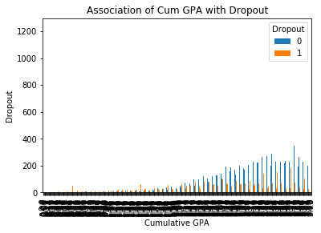
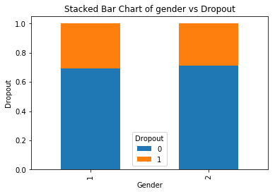
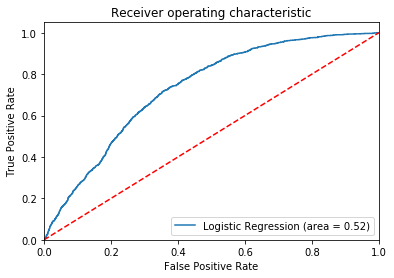

# Student-Dropout-Prediction


```python
#Importing required packages 
import pandas as pd
import numpy as np
from sklearn.feature_selection import RFE
from sklearn.linear_model import LogisticRegression
from sklearn.model_selection import cross_val_score
from sklearn.metrics import accuracy_score
from sklearn.metrics import recall_score
from sklearn.metrics import f1_score
from sklearn.metrics import confusion_matrix
from sklearn.metrics import precision_score
from sklearn import model_selection
from sklearn.tree import DecisionTreeClassifier
import matplotlib.pyplot as plt 
from sklearn.cross_validation import train_test_split
from sklearn.metrics import classification_report
from sklearn.ensemble import RandomForestClassifier
from sklearn.ensemble import BaggingClassifier
```

    C:\Users\dev\Anaconda3\lib\site-packages\sklearn\cross_validation.py:41: DeprecationWarning: This module was deprecated in version 0.18 in favor of the model_selection module into which all the refactored classes and functions are moved. Also note that the interface of the new CV iterators are different from that of this module. This module will be removed in 0.20.
      "This module will be removed in 0.20.", DeprecationWarning)
    


```python
#Train data import
dropout_df= pd.read_csv("C:/Users/dev/iCloudDrive/Prathibha/RetentionTrain.csv")

#Changing column names to make it consistance in all the columns
dropout_df.rename(columns=lambda x: x.replace('Marital Status', 'Maritalstatus'), inplace=True)
dropout_df.rename(columns=lambda x: x.replace('Adjusted Gross Income', 'AdjgrsIncome'), inplace=True)
dropout_df.rename(columns=lambda x: x.replace('Parent Adjusted Gross Income', 'ParentsadjgrsIncome'), inplace=True)
dropout_df.rename(columns=lambda x: x.replace("Father's Highest Grade Level", 'FatherEdu'), inplace=True)
dropout_df.rename(columns=lambda x: x.replace("Mother's Highest Grade Level", 'MotherEdu'), inplace=True)


dropout_df.isnull()
dropout_df.fillna(0)
dropout_df.replace(r'^\s*$', np.NaN, regex=True, inplace = True)
dropout_df.replace(np.NaN, 0, inplace = True)
dropout_df.columns.values
dropout_df.head(1)
dropout_df.describe()

dropout_df.to_csv('c:/Users/dev/iCloudDrive/Prathibha/dropout_final.csv')
# del
```


```python
# deleting these columns as they had most of the NaNs
for xt in ['Campus', 'Address2','State','City','Address1']:
  del dropout_df[xt]
  
# converting strings to categorical variables
cat_vars=['Housing','MotherEdu', 'FatherEdu','Maritalstatus','Cohort','AcademicYear']
for var in cat_vars:
    cat_list='var'+'_'+var
    cat_list = pd.get_dummies(dropout_df[var], prefix=var)
    dropout_df1=dropout_df.join(cat_list)
    dropout_df=dropout_df1
cat_vars=['Housing','MotherEdu', 'FatherEdu','Maritalstatus','Cohort','AcademicYear']
dropout_df_vars=dropout_df.columns.values.tolist()
to_keep=[i for i in dropout_df_vars if i not in cat_vars]
dropout_final=dropout_df[to_keep]
dropout_final.columns.values
dropout_final_vars=dropout_final.columns.values.tolist()
y=['Dropout']
X=[i for i in dropout_final_vars if i not in y]
#dropout_var=dropout_df.columns.values.tolist()

# Data imbalance
dropout_final['Dropout'].value_counts()
```


    0    37375
    1    15593
    Name: Dropout, dtype: int64


```python
# training data sets for recursive feature selection
xtrain =dropout_final[X]
ytrain =dropout_final[y]
xtrain.shape
logreg = LogisticRegression()
rfe = RFE(logreg, 78)
rfe = rfe.fit(xtrain,ytrain )
print(rfe.support_)
print(rfe.ranking_)

# these predictors have an association with the target variable as per feature selection.

cols=['StudentID','Term', 'AdjgrsIncome', 'Parent AdjgrsIncome', '2012 Loan', '2012 Scholarship',
      '2012 Work/Study', '2012 Grant', '2013 Loan', '2013 Scholarship', '2013 Work/Study', 
      '2013 Grant', '2014 Loan', '2014 Scholarship', '2014 Work/Study', '2014 Grant',
      '2015 Loan', '2015 Scholarship', '2015 Work/Study', '2015 Grant', '2016 Loan',
      '2016 Scholarship', '2016 Work/Study','2016 Grant','2017 Loan','2017 Scholarship',
      '2017 Work/Study', '2017 Grant', 'CompleteDevMath', 'CompleteDevEnglish', 'Major1', 
      'Major2', 'Complete1','CompleteCIP1','TermGPA','CumGPA', 'Zip', 'RegistrationDate', 
      'Gender', 'BirthYear', 'BirthMonth', 'Hispanic','Asian', 'Black','White', 
      'TwoOrMoreRace', 'HSDip', 'HSDipYr','HSGPAUnwtd','EnrollmentStatus', 
      'NumColCredAttemptTransfer', 'NumColCredAcceptTransfer', 'CumLoanAtEntry',
      'HighDeg', 'MathPlacement', 'EngPlacement','Housing_Off Campus', 'Housing_With Parent',
      'MotherEdu_College','MotherEdu_High School','MotherEdu_Unknown','FatherEdu_0',
      'FatherEdu_College','FatherEdu_Middle School', 'FatherEdu_Unknown',
      'Maritalstatus_Single','Cohort_2011-12', 'Cohort_2012-13', 'Cohort_2013-14',
      'Cohort_2014-15','Cohort_2015-16', 'Cohort_2016-17','AcademicYear_2011-12',
      'AcademicYear_2012-13','AcademicYear_2013-14', 'AcademicYear_2014-15','AcademicYear_2016-17'] 
dropout_final.shape

X=dropout_final[cols]
y=dropout_final['Dropout']

X.shape
y.shape
```

    C:\Users\dev\Anaconda3\lib\site-packages\sklearn\utils\validation.py:578: DataConversionWarning: A column-vector y was passed when a 1d array was expected. Please change the shape of y to (n_samples, ), for example using ravel().
      y = column_or_1d(y, warn=True)
    

    [ True False  True  True  True  True  True  True  True  True  True  True
      True  True  True  True  True  True  True  True  True  True  True  True
      True  True  True  True  True  True  True  True  True  True False  True
     False False False  True  True  True  True  True  True  True  True False
      True  True False  True  True  True  True  True False False False  True
      True  True  True  True  True  True False False  True False  True False
      True False  True  True False  True  True  True False  True  True False
     False False  True  True  True  True  True  True  True  True  True  True
      True False  True]
    [ 1  5  1  1  1  1  1  1  1  1  1  1  1  1  1  1  1  1  1  1  1  1  1  1
      1  1  1  1  1  1  1  1  1  1 21  1 17 20 13  1  1  1  1  1  1  1  1  6
      1  1  8  1  1  1  1  1 18 19 22  1  1  1  1  1  1  1  3  4  1 12  1  7
      1  2  1  1 15  1  1  1 14  1  1 10 16 11  1  1  1  1  1  1  1  1  1  1
      1  9  1]
    


    (52968,)


```python
## test data pre processing

test_new=pd.read_csv("C:/Users/dev/iCloudDrive/Prathibha/RetentionTest.csv")

test_new.rename(columns=lambda x: x.replace('Marital Status', 'Maritalstatus'), inplace=True)
test_new.rename(columns=lambda x: x.replace('Adjusted Gross Income', 'AdjgrsIncome'), inplace=True)
test_new.rename(columns=lambda x: x.replace('Parent Adjusted Gross Income', 'ParentsadjgrsIncome'), inplace=True)
test_new.rename(columns=lambda x: x.replace("Father's Highest Grade Level", 'FatherEdu'), inplace=True)
test_new.rename(columns=lambda x: x.replace("Mother's Highest Grade Level", 'MotherEdu'), inplace=True)

# data cleaning
test_new.isnull()
test_new.fillna(0)
test_new.replace(r'^\s*$', np.NaN, regex=True, inplace = True)
test_new.replace(np.NaN, 0, inplace = True)

## deleting NaNs in columns by deleting them
for x in ['Campus', 'Address2','State','City','Address1']:
  del test_new[x]
  
#3 Feature selection by converting string type to categorical
catest_vars=['Housing','MotherEdu', 'FatherEdu','Maritalstatus','Cohort','AcademicYear']
   
for tvar in catest_vars:
    #cat_list='var'+'_'+var
    cat_list = pd.get_dummies(test_new[tvar], prefix=tvar)
    test_new1=test_new.join(cat_list)
    test_new =test_new1

data_vars=test_new.columns.values.tolist()
to_keep=[i for i in data_vars if i not in catest_vars]
test_final=test_new[to_keep]
test_final.columns.values

test_final_vars=test_final.columns.values.tolist()

cols1=['StudentID','Term', 'AdjgrsIncome', 'Parent AdjgrsIncome', '2012 Loan', '2012 Scholarship',
      '2012 Work/Study', '2012 Grant', '2013 Loan', '2013 Scholarship', '2013 Work/Study', 
      '2013 Grant', '2014 Loan', '2014 Scholarship', '2014 Work/Study', '2014 Grant',
      '2015 Loan', '2015 Scholarship', '2015 Work/Study', '2015 Grant', '2016 Loan',
      '2016 Scholarship', '2016 Work/Study','2016 Grant','2017 Loan','2017 Scholarship',
      '2017 Work/Study', '2017 Grant', 'CompleteDevMath', 'CompleteDevEnglish', 'Major1', 
      'Major2', 'Complete1','CompleteCIP1','TermGPA','CumGPA', 'Zip', 'RegistrationDate', 
      'Gender', 'BirthYear', 'BirthMonth', 'Hispanic','Asian', 'Black','White', 
      'TwoOrMoreRace', 'HSDip', 'HSDipYr','HSGPAUnwtd','EnrollmentStatus', 
      'NumColCredAttemptTransfer', 'NumColCredAcceptTransfer', 'CumLoanAtEntry',
      'HighDeg', 'MathPlacement', 'EngPlacement','Housing_Off Campus', 'Housing_With Parent',
      'MotherEdu_College','MotherEdu_High School','MotherEdu_Unknown',
      'FatherEdu_College','FatherEdu_Middle School', 'FatherEdu_Unknown','FatherEdu_0',
      'Maritalstatus_Single','Cohort_2011-12', 'Cohort_2012-13', 'Cohort_2013-14',
      'Cohort_2014-15','Cohort_2015-16', 'Cohort_2016-17','AcademicYear_2011-12',
      'AcademicYear_2012-13','AcademicYear_2013-14', 'AcademicYear_2014-15','AcademicYear_2016-17'] 
```


```python
## exploratory data analysis-- bar plot and histogram


dropout_df.groupby('Term').mean()
dropout_df.groupby('Gender').mean()
dropout_df.groupby('Dropout').mean()
pd.crosstab(dropout_df.CumGPA,dropout_df.Dropout).plot(kind='bar')
plt.title('Association of Cum GPA with Dropout')
plt.xlabel('Cumulative GPA')
plt.ylabel('Dropout')
plt.savefig('Dropout_gpa')


table=pd.crosstab(dropout_df.Gender,dropout_df.Dropout)
table.div(table.sum(1).astype(float), axis=0).plot(kind='bar', stacked=True)
plt.title('Stacked Bar Chart of gender vs Dropout')
plt.xlabel('Gender')
plt.ylabel('Dropout')
plt.savefig('gendervsdropout')
```








```python
# train data split 
X_train, X_test, y_train, y_test = train_test_split(X, y, test_size=0.3, random_state=0)
X_train.shape
X_test.shape
y_train.shape
y_test.shape
```


    (15891,)


```python
#Logistics Regression Model
logreg = LogisticRegression()
result1=logreg.fit(X_train, y_train)

y_predlog = logreg.predict(X_test)

## cross validation
kfold = model_selection.KFold(n_splits=10, random_state=7)
modelCV = LogisticRegression()
scoring = 'accuracy'
results = model_selection.cross_val_score(modelCV, X_train, y_train, cv=kfold, scoring=scoring)
print("10-fold cross validation average accuracy: %.3f" % (results.mean()))
confusion_matrix = confusion_matrix(y_test, y_predlog)
print(confusion_matrix)
print(classification_report(y_test, y_predlog))

# performance measures
print("logistic scores",accuracy_score(y_test, y_predlog))
print("logistic scores",f1_score(y_test, y_predlog,average='weighted'))
print("logistic recall_score ",recall_score(y_test, y_predlog))
print("logistic precision_score ",precision_score(y_test, y_predlog)) 

```

    10-fold cross validation average accuracy: 0.709
    [[11019   192]
     [ 4391   289]]
                 precision    recall  f1-score   support
    
              0       0.72      0.98      0.83     11211
              1       0.60      0.06      0.11      4680
    
    avg / total       0.68      0.71      0.62     15891
    
    logistic scores 0.7115977597382166
    logistic scores 0.6170206578860977
    logistic recall_score  0.061752136752136755
    logistic precision_score  0.6008316008316008
    


```python
from sklearn.metrics import roc_auc_score
from sklearn.metrics import roc_curve
logit_roc_auc = roc_auc_score(y_test, logreg.predict(X_test))
fpr, tpr, thresholds = roc_curve(y_test, logreg.predict_proba(X_test)[:,1])
plt.figure()
plt.plot(fpr, tpr, label='Logistic Regression (area = %0.2f)' % logit_roc_auc)
plt.plot([0, 1], [0, 1],'r--')
plt.xlim([0.0, 1.0])
plt.ylim([0.0, 1.05])
plt.xlabel('False Positive Rate')
plt.ylabel('True Positive Rate')
plt.title('Receiver operating characteristic')
plt.legend(loc="lower right")
plt.savefig('Log_ROC')
plt.show()

# dropuout prediction using test data in logistic regression

xtest =test_final[cols1]
y_pred_req = logreg.predict(xtest)
student_ids =test_final['StudentID']
dropout_series = pd.Series(y_pred_req)
solution_df1 = pd.DataFrame()
solution_df1['StudentID'] = student_ids 
solution_df1['Dropout'] = dropout_series
solution_df1 = solution_df1.drop_duplicates(subset='StudentID')
#solution_df1.to_csv('c:/Users/dev/iCloudDrive/Prathibha/solution_logreg.csv')
```





```python
## Decision tree using gini criterion

dt_gini = DecisionTreeClassifier(criterion = "gini", random_state = 100,
                               max_depth=3, min_samples_leaf=5,min_samples_split=20)
dt_gini.fit(X_train, y_train)
y_predict_gini = dt_gini.predict(X_test)

#Performance measures

print("Decision tree-gini -f1",f1_score(y_test,y_predict_gini, average='weighted'))
print("Decision tree-gini-accuracy",accuracy_score(y_test,y_predict_gini))
print("Decision tree-gini recall",recall_score(y_test,y_predict_gini ))
print("Decision tree-gini precision",precision_score(y_test, y_predict_gini)) 

# dropuout prediction using test data in Decision Tree
y_predict_req2 = dt_gini.predict(xtest)
student_ids2 =test_final['StudentID']
dropout_series2 = pd.Series(y_predict_req2)
solution_df2 = pd.DataFrame()
solution_df2['StudentID'] = student_ids2 
solution_df2['Dropout'] = dropout_series2
solution_df2 = solution_df2.drop_duplicates(subset='StudentID')
#solution_df2.to_csv('c:/Users/dev/iCloudDrive/Prathibha/solution_giniDT.csv')
```

    Decision tree-gini -f1 0.7142460325953922
    Decision tree-gini-accuracy 0.7655276571644327
    Decision tree-gini recall 0.23931623931623933
    Decision tree-gini precision 0.8709175738724728
    


```python
## Decision tree using entropy criterion

dt_entropy = DecisionTreeClassifier(criterion = "entropy", random_state = 100,
                               max_depth=3, min_samples_leaf=5,min_samples_split=20)
dt_entropy.fit(X_train, y_train)
y_predict_entropy = dt_entropy.predict(X_test)

#Performance measures
print("Decision tree-entropy",f1_score(y_test,y_predict_entropy))
print("Decision tree-entropy",accuracy_score(y_test,y_predict_entropy))
print("Decision tree-entropy recall",recall_score(y_test,y_predict_entropy ))
print("Decision tree-entropy precision",precision_score(y_test, y_predict_entropy)) 

#dropuout prediction using test data in Decision Tree using entropy

y_predict_req3 = dt_entropy.predict(xtest)
student_ids3 =test_final['StudentID']
dropout_series3 = pd.Series(y_predict_req3)
solution_df3 = pd.DataFrame()
solution_df3['StudentID'] = student_ids3 
solution_df3['Dropout'] = dropout_series3
solution_df3 = solution_df3.drop_duplicates(subset='StudentID')
#solution_df3.to_csv('c:/Users/dev/iCloudDrive/Prathibha/solution_entropyDT.csv')
```

    Decision tree-entropy 0.49490084985835686
    Decision tree-entropy 0.7755962494493739
    Decision tree-entropy recall 0.3732905982905983
    Decision tree-entropy precision 0.7340336134453781
    


```python
## Ensemble Methods

seed = 7
kfold = model_selection.KFold(n_splits=10, random_state=seed)
cart = DecisionTreeClassifier()
num_trees = 100
model1 = BaggingClassifier( n_estimators=num_trees, random_state=seed)
model1.fit(X_train,y_train)
y_pred_bagging1 = model1.predict(X_test)
print("Bagging f1:",f1_score(y_test,y_pred_bagging1))
print("Bagging  accuracy",accuracy_score(y_test,y_pred_bagging1))
print("Bagging  recall",recall_score(y_test,y_pred_bagging1 ))
print("Bagging  precision",precision_score(y_test,y_pred_bagging1 ))

#dropuout prediction using test data in Decision Tree using bagging 
y_pred_bagging = model1.predict(xtest)
student_ids4 =test_final['StudentID']
dropout_series4 = pd.Series(y_pred_bagging)
solution_df4 = pd.DataFrame()
solution_df4['StudentID'] = student_ids4 
solution_df4['Dropout'] = dropout_series4
solution_df4 = solution_df4.drop_duplicates(subset='StudentID')
#solution_df4.to_csv('c:/Users/dev/iCloudDrive/Prathibha/solution_bagging.csv')
```

    Bagging f1: 0.9460338101430429
    Bagging  accuracy 0.9686615065131207
    Bagging  recall 0.9326923076923077
    Bagging  precision 0.9597625329815304
    


```python
## Random Forest
max_features = 10
model2 = RandomForestClassifier(n_estimators=num_trees, max_features=max_features)
results2 = model_selection.cross_val_score(model2,X_train, y_train, cv=kfold)
print(results2.mean())
model2.fit(X_train,y_train)
y_pred_RF1 = model2.predict(X_test)
print("RF F1",f1_score(y_test,y_pred_RF1))
print("RF accuracy",accuracy_score(y_test,y_pred_RF1))
print("RF recall",recall_score(y_test,y_pred_RF1 ))
print("RF precision",precision_score(y_test,y_pred_RF1 ))

#dropuout prediction using test data in Random Forest
y_pred_RF = model2.predict(xtest)
student_ids5 =test_final['StudentID']
dropout_series5 = pd.Series(y_pred_RF)
solution_df5 = pd.DataFrame()
solution_df5['StudentID'] = student_ids5 
solution_df5['Dropout'] = dropout_series5
solution_df5 = solution_df5.drop_duplicates(subset='StudentID')
#solution_df5.to_csv('c:/Users/dev/iCloudDrive/Prathibha/solution_RF_10.csv')
```

    0.9731370051527927
    RF F1 0.9609315485907062
    RF accuracy 0.9774085960606632
    RF recall 0.9433760683760684
    RF precision 0.9791528055001109
    


```python
from sklearn.ensemble import ExtraTreesClassifier

max_features = 10
model3 = ExtraTreesClassifier(n_estimators=num_trees, max_features=max_features)
results3 = model_selection.cross_val_score(model3, X_train, y_train, cv=kfold)
print(results3.mean())
model3.fit(X_train,y_train)

y_pred_ET1 = model3.predict(X_test)
print("ET F1",f1_score(y_test,y_pred_ET1))
print("ET accuracy",accuracy_score(y_test,y_pred_ET1))
print("ET recall",recall_score(y_test,y_pred_ET1 ))
print("ET precision",precision_score(y_test,y_pred_ET1 ))

#dropuout prediction using test data in ExtraTreesClassifier
y_pred_ET = model3.predict(xtest)
student_ids6 =test_final['StudentID']
dropout_series6 = pd.Series(y_pred_ET)
solution_df6 = pd.DataFrame()
solution_df6['StudentID'] = student_ids6 
solution_df6['Dropout'] = dropout_series6
solution_df6 = solution_df6.drop_duplicates(subset='StudentID')

#solution_df6.to_csv('c:/Users/dev/iCloudDrive/Prathibha/solution_ET_10.csv')
```

    0.9709253085142573
    ET F1 0.9575929357898181
    ET accuracy 0.9755207350072368
    ET recall 0.9384615384615385
    ET precision 0.977520587580681
    


```python
from sklearn.ensemble import AdaBoostClassifier

num_trees = 100
model4 = AdaBoostClassifier(n_estimators=num_trees, random_state=seed)
results4 = cross_val_score(model4, X_train,y_train, cv=kfold)
print(results4.mean())
model4.fit(X_train,y_train)

#dropuout prediction using test data in AdaBoostClassifier
y_pred_Adaboost1 = model4.predict(X_test)
print("Adaboost F1",f1_score(y_test,y_pred_Adaboost1))
print("Adaboost accuracy",accuracy_score(y_test,y_pred_Adaboost1))
print("Adaboost recall",recall_score(y_test,y_pred_Adaboost1 ))
print("Adaboost precision",precision_score(y_test,y_pred_Adaboost1 ))

y_pred_Adaboost = model4.predict(xtest)
student_ids7 =test_final['StudentID']
dropout_series7 = pd.Series(y_pred_Adaboost)
solution_df7 = pd.DataFrame()
solution_df7['StudentID'] = student_ids7 
solution_df7['Dropout'] = dropout_series7
solution_df7 = solution_df7.drop_duplicates(subset='StudentID')

#solution_df7.to_csv('c:/Users/dev/iCloudDrive/Prathibha/solution_Adaboost.csv')
```

    0.8060252128033234
    Adaboost F1 0.637583081570997
    Adaboost accuracy 0.8112768233591341
    Adaboost recall 0.5636752136752137
    Adaboost precision 0.7337969401947149
    


```python
from sklearn.ensemble import GradientBoostingClassifier

num_trees = 200
model5 = GradientBoostingClassifier(n_estimators=num_trees, random_state=seed)
results = model_selection.cross_val_score(model5, X_train, y_train, cv=kfold)
print(results.mean())
model5.fit(X_train,y_train)

y_pred_Gboost1 = model5.predict(X_test)
print("Gboost F1",f1_score(y_test,y_pred_Gboost1))
print("Gboost accuracy",accuracy_score(y_test,y_pred_Gboost1))
print("Gboost recall",recall_score(y_test,y_pred_Gboost1 ))
print("Gboost precision",precision_score(y_test,y_pred_Gboost1 ))

#dropuout prediction using test data in GradientBoostingClassifier
y_pred_Gboost = model5.predict(xtest)
student_ids8 =test_final['StudentID']
dropout_series8 = pd.Series(y_pred_Gboost)
solution_df8 = pd.DataFrame()
solution_df8['StudentID'] = student_ids8 
solution_df8['Dropout'] = dropout_series8
#solution_df8 = solution_df8.drop_duplicates(subset='StudentID')
```

    0.8487471150675898
    Gboost F1 0.7055465938702072
    Gboost accuracy 0.8506701906739664
    Gboost recall 0.6074786324786324
    Gboost precision 0.8413731873335306
    

So, Gradient Boosting is yielding 85% accuracy on prediction of student dropout.
